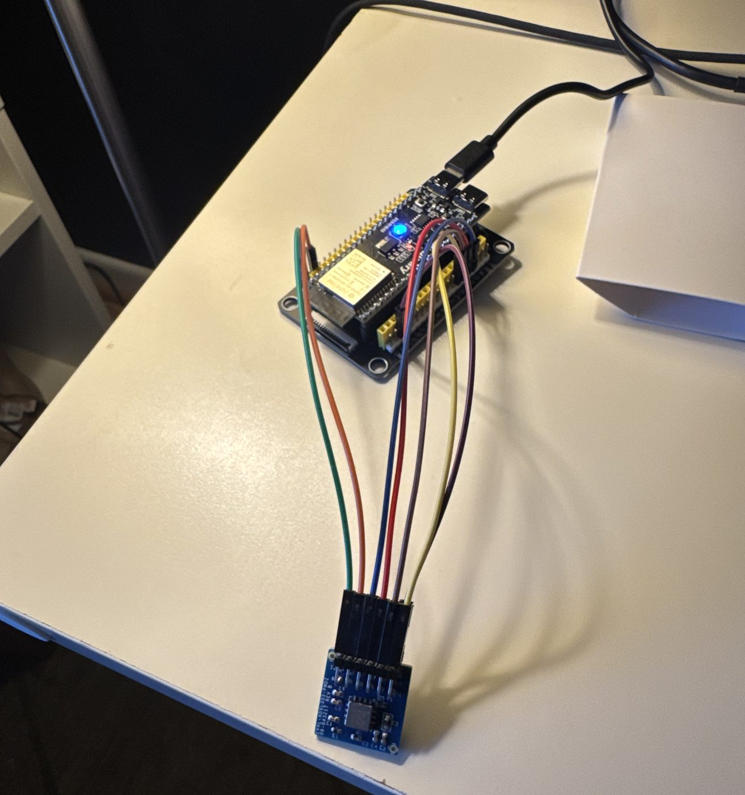
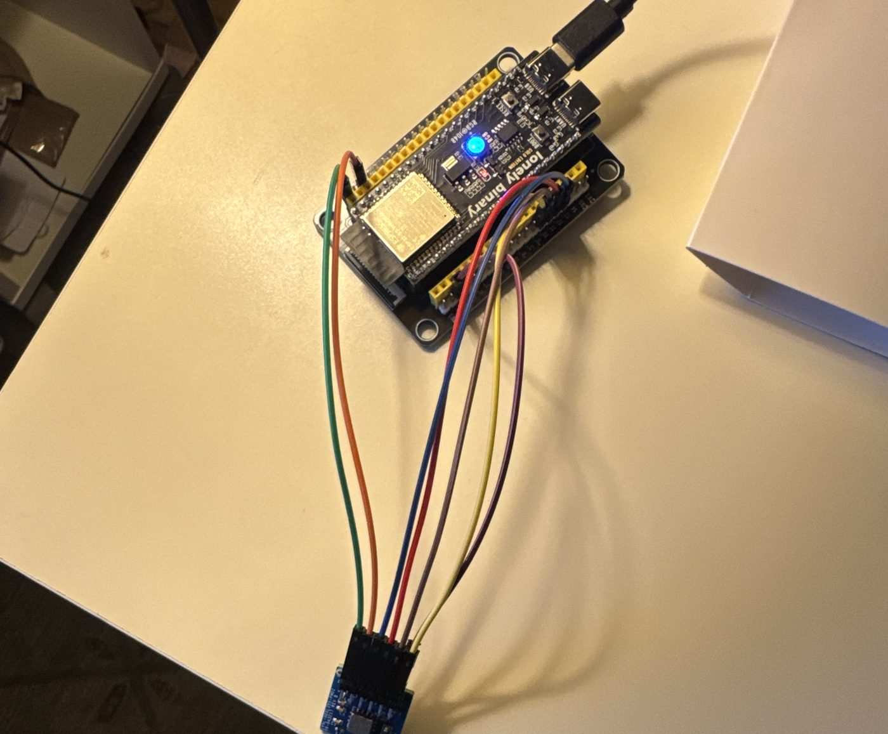
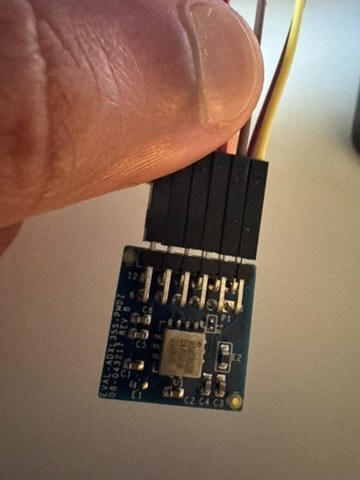

# The device

> Introduce the hardware: what each part does, and why you chose a MEMS accelerometer over a geophone or seismometer.

  <figure><figcaption>Bench setup: the ESP32-S3 board (top) and the ADXL355 breakout (bottom).</figcaption></figure>
  <figure><figcaption>Wiring, viewed from above.</figcaption></figure>
  <figure><figcaption>The EVAL-ADXL355-PMDZ sensor board.</figcaption></figure>

## Parts

| Part | What it is | Role |
|---|---|---|
| ADXL355 (EVAL-ADXL355-PMDZ) | 3-axis, low-noise MEMS accelerometer | Senses ground motion |
| ESP32-S3 (WROOM-1-N16R8 class) | Dual-core Xtensa LX7 microcontroller, 512 KB internal SRAM | Runs filtering and the neural network on the device |
| Jumper wires | SPI bus plus one interrupt line | Connect the sensor to the board |

> Add anything missing (power, enclosure, mount) and roughly what the whole build costs.

## Wiring

| Signal | ESP32-S3 GPIO |
|---|---|
| CS | `10` |
| MOSI | `11` |
| SCLK | `12` |
| MISO | `13` |
| INT1 (sensor P1 pin 7) | `4` |

From `firmware/adxl355_capture/main/capture.c`.
{: .note}

## Bench tests

| Test | Date | Outcome |
|---|---|---|
| Bring-up gate: sensor identified over SPI | 30 Aug 2026 | passed 18/18 reads |
| H-2: gravity, all six orientations | 30 Aug 2026 | passed |
| H-1: noise floor, 1 h at rest on foam | 5 Sep 2026 | Recorded: [see figure](results.html#h1) |

> For each test, say what it checks and why it has to pass before the next step. Explain why the mount matters, too.
