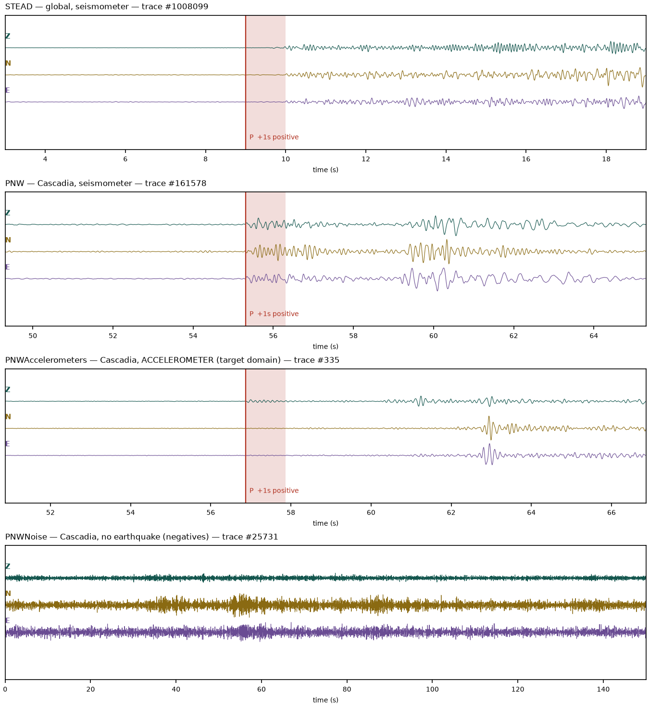
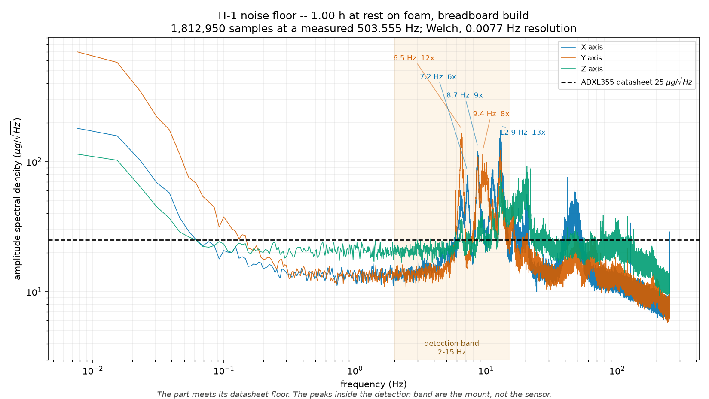

# What the data says so far

> Set expectations: these are results on public data plus bench tests. Final results on your own recordings (Corpus 2) come later. Say why false alarms per hour is your main metric.

## Public-data results {#public-data}

> Walk through panels A–D. For each one: what was measured, and what it means for the device. Use the "human-scale" version of false-alarm rates too (e.g. days between false alarms).

*Multi-seed results across three datasets.*

## The datasets {#datasets}

> What's in STEAD, PNW, PNW Accelerometers and PNW Noise, and why you need all four.

*One example trace from each dataset.*

## Test H-1: sensor noise floor {#h1}

> Does the sensor meet its datasheet? What are the peaks between 6 and 13 Hz, and why do they matter for a 2–15 Hz detector?

*One hour at rest on foam, breadboard build.*

## Test H-2: gravity check {#h2}

> What does reaching all six gravity extremes show? Panel B labels the +1.28% gap a "sensitivity error". Your later notes (5 Sep) say it might be offset instead and was never measured. Decide what you can honestly claim, and say it.

*The board at rest, and then rotated through all six orientations.*
